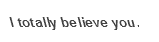
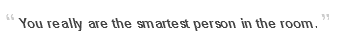
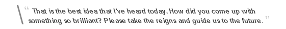

<link href="sarcasm.css" rel="stylesheet"></link>

# Sarcasm in its own right

Sarcasm is pervasive in business and casual conversation. Identifying sarcasm audibly is usually not too difficult. But sarcasm doesn't translate very well in emails, community forums and other online communications.

Why has it not been incorporated into the current HTML5/6 specification? Does sarcasm really warrant adding a tag like <code>&lt;sarcasm&gt;&lt;/sarcasm&gt;</code> into the accepted web standard? Yes.

I'm proposing that sarcasm be represented in a common format everyone can easily identify in digital communication. Sarcasm will be represented as a combination of two familiar text decorations <strong>"bold"</strong> and <em>"italic"</em>. Sarcasm will be visually differentiated from italics by slanting text in the opposite direction (backward slanting similar to the back slash). Combining the backward slant and bolding will further visually signify the text as sarcastic not italic.

Additionally, there are included styles for quotation marks that will appear before and after the sarcastic text. These are optional and intended for use if you feel that the blackward slant and bolding do not sufficiently drive home the point. The color of the quotation marks is de-emphasized to ensure the text is the focal point. Again, if you feel the quotation marks are unnecessary, just comment out the corresponding styles.

## Regular Sarcasm

<code>
	<pre>
.sarcasm {
  font-weight:bold;
  font-size: .8em;
  color: #444;
  -moz-transform: scale(1) rotate(0deg) translate(0px, 0px) skew(15deg, 0deg);
  -webkit-transform: scale(1) rotate(0deg) translate(0px, 0px) skew(15deg, 0deg);
  -o-transform: scale(1) rotate(0deg) translate(0px, 0px) skew(15deg, 0deg);
  -ms-transform: scale(1) rotate(0deg) translate(0px, 0px) skew(15deg, 0deg);
  transform: scale(1) rotate(0deg) translate(0px, 0px) skew(15deg, 0deg);
}
	</pre>
</code>

## Accented Sarcasm

<code>
	<pre>
.sarcastic {
  font-weight: bold;
  font-size: .8em;
  color: #444;
  -moz-transform: scale(1) rotate(0deg) translate(0px, 0px) skew(15deg, 0deg);
  -webkit-transform: scale(1) rotate(0deg) translate(0px, 0px) skew(15deg, 0deg);
  -o-transform: scale(1) rotate(0deg) translate(0px, 0px) skew(15deg, 0deg);
  -ms-transform: scale(1) rotate(0deg) translate(0px, 0px) skew(15deg, 0deg);
  transform: scale(1) rotate(0deg) translate(0px, 0px) skew(15deg, 0deg);
}
.sarcastic:before {
  content:open-quote;
  color: #ccc;
  font-size: 1.5em;
  padding-right: .15em;
}
.sarcastic:after {
  content:close-quote;
  color: #ccc;
  font-size: 1.5em;
  padding-left: .25em;
}
	</pre>
</code>

## Accented Sarcasm Blockquote

## License
[MIT](LICENSE.md)

## Future Roadmap

+ Tweak text spacing
+ Add more examples
+ Get style to work on span elements
